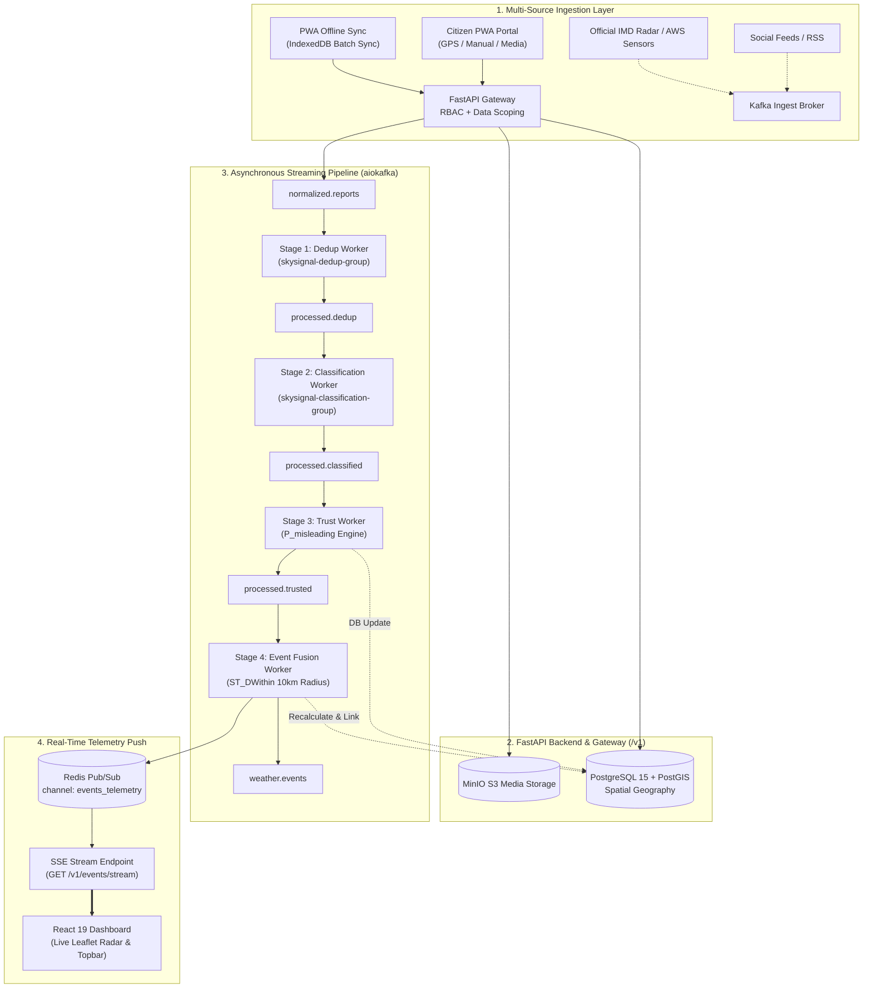

# ⛈️ SkySignal — National Weather Intelligence Platform

> **Team Skyscrapers** · **SIH26069: National Weather Big Data Analytics Platform**  
> **Ministry of Earth Sciences (MoES) / India Meteorological Department (IMD)**  
> *Real-Time Multi-Source Meteorological Telemetry Aggregation, Deduplication, and Spatio-Temporal Event Fusion Engine.*

[](https://fastapi.tiangolo.com)
[](https://react.dev)
[](https://postgis.net)
[](https://redpanda.com)
[](https://redis.io)
[](https://min.io)
[](#-automated-testing)

---

## 📌 Executive Summary

**SkySignal** is an enterprise-grade, distributed meteorological intelligence platform designed to ingest raw citizen weather observations, social media signals, and automated sensor telemetry, corroborate them against official IMD radar and AWS data, deduplicate near-identical submissions across space and time, estimate credibility via AI trust scoring, and fuse them into actionable national weather events in real time.

Built with strict data scoping and role-based access control (RBAC), the platform provides:
1. **A public situational awareness portal & offline PWA** for citizens and first responders.
2. **A secure, real-time command portal** for IMD analysts and emergency dispatchers.

---

## 🏛️ System Architecture



---

## ✨ Key Capabilities & Feature Modules

### 🌐 1. Citizen & Public Portal (Zero-Auth Experience)
- **Live Geospatial Radar Map:** Interactive Leaflet radar map with dark atmospheric styling, real-time hazard markers, active alert zones, and dynamic event telemetry slide-out panels.
- **Zero-Auth Incident Reporting (`/report`):** Report extreme weather (Heavy Rain, Flooding, Thunderstorms, Fog, Heatwave, Strong Winds) in under 15 seconds with GPS auto-detection, interactive coordinate adjustment, severity ratings, and photo evidence upload.
- **Offline-First PWA & Batch Sync:** Full offline resilience using client-side **IndexedDB**. When connectivity drops, reports are cached locally with deterministic UUID idempotency keys and automatically batch-synced upon reconnection (`POST /v1/reports/batch-sync`).
- **Session History (`/report` $\to$ My Submissions):** Device-scoped query (`GET /v1/reports/mine`) displaying previous submissions without leaking personal identity or requiring registration.
- **Crisis Aid & Relief Network (`/relief-network`):** Real-time directory and map of operational evacuation shelters, medical relief camps, clean water supply points, and food distribution centers with live capacity indicators.
- **Emergency Directory & Helplines (`/emergency`):** Direct one-tap SOS calling for NDRF, State Disaster Management Authorities (SDMA), ambulance services, and regional flood control rooms.
- **Bilingual Accessibility:** Instant toggle between **English** and **हिन्दी (Hindi)** powered by `i18next`.

---

### 🛡️ 2. IMD Analyst Command Portal (RBAC Protected)
- **Granular Role-Based Access Control:** Secure authentication via signed HS256 JWT tokens. Sensitive endpoints (verification triage, duplicate review, merge/escalate actions, audit logs) reject unauthorized access.
- **Verification Queue (`/verification`):** High-priority triage console featuring:
  - **AI Trust Scoring & Credibility Estimation:** Calculates Misleading Risk Probability ($P_{\text{misleading}}$) and category confidence (0.60–0.99).
  - **Media Evidence Inspector:** High-resolution photo/video review with EXIF timestamp and metadata checks.
  - **Sensor Cross-Corroboration:** Cross-references citizen submissions with nearby official IMD radar returns and AWS weather sensors.
  - **1-Click Actions:** Verify, Reject, Request Further Information, or Escalate to National Emergency tiers.
- **Spatio-Temporal Duplicate Review (`/duplicates`):** PostGIS-driven clustering engine running spatial queries within a dynamic **10-kilometer radius and 6-hour sliding window**. Analysts can review cluster similarity matrices and merge redundant reports into a single canonical event.
- **Data Sources & Pipeline Telemetry (`/sources`):** Real-time monitoring of the 4-stage Apache Kafka pipeline, buffer queues, MinIO S3 media storage volume, and Redis Pub/Sub SSE connection health.
- **Incident Analytics & Retrospectives (`/analytics`):** Interactive Recharts visualizations of hazard distribution by state, hourly report velocity, verification latency, and incident resolution rates.
- **Immutable Audit Log (`/audit`):** Cryptographically timestamped chronological ledger of all administrative decisions, including analyst attribution, action types (`VERIFY_REPORT`, `MERGE_EVENT`), and IP origins.

---

## 🛠️ Technology Stack

| Layer | Technologies |
|---|---|
| **Frontend SPA** | React 19, TypeScript, Vite, Tailwind CSS v4, Lucide Icons, Recharts |
| **Geospatial Mapping** | Leaflet, React-Leaflet, Leaflet MarkerCluster, OpenStreetMap / CartoDB Dark |
| **Offline Storage & i18n** | IndexedDB (`idb`), `i18next`, `react-i18next`, PWA Service Worker |
| **Backend API** | FastAPI, Uvicorn, Pydantic Settings, AsyncPG, Python 3.11+ |
| **Database & GIS** | PostgreSQL 15, PostGIS 3.3, GeoAlchemy2, SQLAlchemy 2.0 (Async) |
| **Streaming & Pub/Sub**| Apache Kafka / Redpanda (`aiokafka`), Redis 7 Alpine (`redis-py`) |
| **Media Storage** | MinIO (S3-compatible distributed object storage) |

---

## 🚀 Getting Started

### Prerequisites
- [Node.js](https://nodejs.org/) (v18.0+)
- [Python](https://www.python.org/) (v3.11+)
- [Docker & Docker Compose](https://www.docker.com/) *(Optional for full infrastructure stack)*

---

### Step 1: Run the Frontend (Quick Start)

```bash
# In the project root directory
npm install
npm run dev
```

The application will be live at: **`http://localhost:5173`**

---

### Step 2: Start Infrastructure Containers *(Optional)*

Spin up PostgreSQL (PostGIS), Redpanda (Kafka), Redis, and MinIO:

```bash
docker compose up -d
```

| Service | Port | Purpose | Credentials |
|---|---|---|---|
| **PostgreSQL + PostGIS** | `5432` | Spatial DB & GeoAlchemy2 | `skygrid` / `skygrid_secret` |
| **Redpanda / Kafka** | `9092` | Message Streaming Broker | (None) |
| **Redis** | `6379` | Telemetry Pub/Sub & Cache | (None) |
| **MinIO API** | `9000` | S3 Media Storage API | `skygrid` / `skygrid_secret` |
| **MinIO Console** | `9001` | Object Storage Web Console | `skygrid` / `skygrid_secret` |

---

### Step 3: Run the FastAPI Backend *(Optional)*

```bash
cd backend

# Create virtual environment and install dependencies
python -m venv .venv

# On Windows:
.\.venv\Scripts\activate
# On Linux/macOS:
source .venv/bin/activate

pip install -r requirements.txt

# Start the API server
uvicorn app.main:app --reload --host 0.0.0.0 --port 8000
```

- **Interactive Swagger Docs:** [http://localhost:8000/docs](http://localhost:8000/docs)
- **ReDoc:** [http://localhost:8000/redoc](http://localhost:8000/redoc)

---

## 🔑 Demo Analyst Credentials

To access analyst-restricted dashboards (*Verification Queue, Duplicate Clusters, Incident Analytics, Pipeline Sources, Audit Logs*):

- **Email:** `analyst@imd.gov.in`
- **Password:** `Analyst@123`
- *Or click **"Autofill Demo Analyst"** directly inside the Topbar Login Modal.*

---

## 📡 Core API Specification

### Public Endpoints (No Auth Required)

| Method | Path | Headers / Params | Description |
|---|---|---|---|
| `POST` | `/v1/reports` | `X-Device-Id` (req), `multipart/form-data` | Ingests raw report, saves media to MinIO, pushes to `raw.citizen`. |
| `POST` | `/v1/reports/batch-sync` | `X-Device-Id` (req), `application/json` | PWA offline synchronization with `client_report_id` idempotency. |
| `GET` | `/v1/events` | `bbox`, `lat`, `lon`, `radius_km`, `category` | Public event list (enforces query filter: `confirmed`, `active`). |
| `GET` | `/v1/reports/mine` | `X-Device-Id` (req) | Returns reports submitted by the requesting device session. |

### Analyst / Administrative Endpoints (Admin JWT Required)

| Method | Path | Auth Scheme | Description |
|---|---|---|---|
| `POST` | `/v1/auth/login` | Public (`email`, `password`) | Returns signed 8-hour JWT token with analyst/senior_admin claim. |
| `GET` | `/v1/events/stream` | Bearer Token or `?token=` | Real-time Server-Sent Events (SSE) telemetry push via Redis. |
| `GET` | `/v1/reports/{id}` | Bearer Token (`analyst`) | Full report detail including duplicate clusters and evidence. |
| `POST` | `/v1/reports/{id}/verify` | Bearer Token (`analyst`) | Marks report as verified and triggers lifecycle transition. |
| `POST` | `/v1/events/{id}/merge` | Bearer Token (`analyst`) | Merges duplicate weather events and consolidates reports. |
| `GET` | `/v1/audit-log` | Bearer Token (`analyst`) | Immutable administrative action history and audit records. |

---

## 🧪 Automated Testing

The backend includes a comprehensive, isolated integration and unit test suite verified with Pytest:

```bash
pytest backend/tests/ -v
```

```text
======================= 82 passed, 8 warnings in 10.54s =======================
```

- `test_fusion_and_stream.py` (8 tests): PostGIS `ST_DWithin` spatial fusion, Redis Pub/Sub, SSE streaming.
- `test_kafka_workers.py` (11 tests): Dedup, Classification, and Trust Kafka worker pipelines.
- `test_public_endpoints.py` (7 tests): Multipart report submission, MinIO storage, offline batch idempotency.
- `test_security_and_storage.py` (12 tests): Password hashing, JWT cycles, RBAC guards, MinIO upload client.
- `test_health.py` (5 tests): Health probes, CORS configuration, header exposures.
- `test_public_data_scoping.py` (6 tests): Guest status query scoping and existence hiding.
- `test_endpoints_lockdown.py` (21 tests): Comprehensive 401/403 lockdown across operational routes.
- `test_rbac_unit.py` (12 tests): JWT token edge cases, expiry, and role verification.

---

## 👥 Team & Attribution

Developed by **Team Skyscrapers** for the **Smart India Hackathon (SIH26069)** under the auspices of the **Ministry of Earth Sciences (MoES)** and the **India Meteorological Department (IMD)**.
